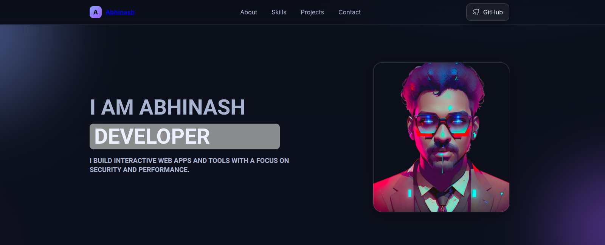
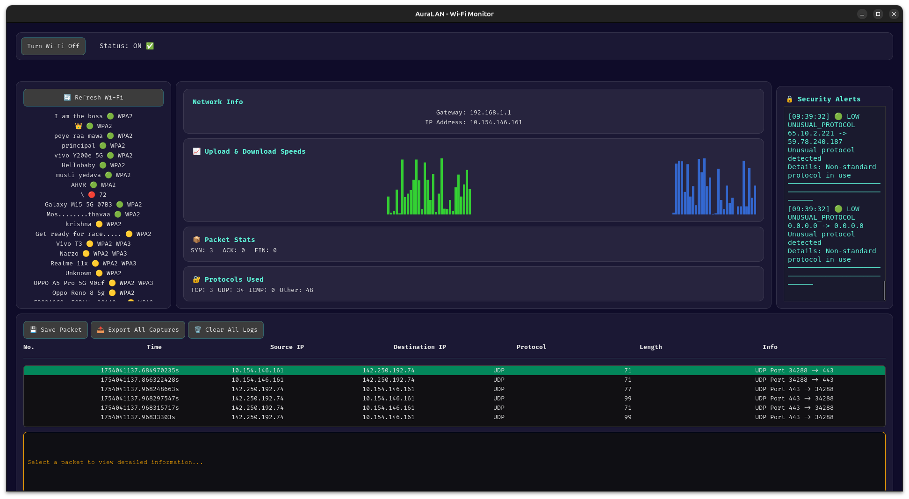

# 👋 Hi, I’m Abhinash  

<p align="center">
  
</p>

---

# ✨ Abhinash • Portfolio Website  



<p align="center">
  <b>A modern, interactive portfolio website built with Glassmorphism, HTML, CSS & JavaScript 🚀</b>
</p>

---

## 🌍 Live Demo  
🔗 [Visit Portfolio](https://abhinash000.github.io/PORTFOLIO/) *(Enable GitHub Pages after pushing!)*

---

## 📖 Table of Contents
- [🚀 Features](#-features)
- [🛠️ Tech Stack](#️-tech-stack)
- [📂 Project Structure](#-project-structure)
- [📸 Screenshots](#-screenshots)
- [⚡ Setup & Run Locally](#-setup--run-locally)
- [🌍 Deployment](#-deployment)
- [📌 Projects Highlighted](#-projects-highlighted)
- [📬 Contact](#-contact)
- [⚖️ License](#️-license)

---

## 🚀 Features
✅ Responsive & Mobile-first  
✅ Glassmorphism design 🎨  
✅ Animated hero section ✨  
✅ Drawer navigation for mobile 📱  
✅ Skill cards with SVG icons ⚡  
✅ Project showcase with GitHub + Demo links 💻  
✅ Contact form (ready to hook into backend) 📬  

---

## 🛠️ Tech Stack  


---

## 📂 Project Structure
<details>
<summary>Click to expand</summary>

```

PORTFOLIO/
│── index.html        # Main page
│── styles.css        # Styles
│── script.js         # Animations & drawer logic
│── src/              # Assets (images, icons, screenshots)
│── README.md         # Project documentation

````
</details>

---

## 📸 Screenshots  

### 🏠 Hero Section
  

### 💻 Projects
  

---

## ⚡ Setup & Run Locally
```bash
# 1. Clone the repository
git clone https://github.com/abhinash000/PORTFOLIO.git

# 2. Move into project directory
cd PORTFOLIO

# 3. Open index.html in your browser
xdg-open index.html   # Linux
open index.html       # macOS
start index.html      # Windows
````

---

## 🌍 Deployment

Easily host this portfolio:

* **GitHub Pages** → Free & built-in
* **Netlify** → Drag & drop deploy
* **Vercel** → Connect GitHub, auto-deploy

---

## 📌 Projects Highlighted

* 🖼️ **Personal Portfolio** – this very site!
* ⚡ **AuraLAN** – Packet sniffer in Rust (GTK4-powered)
* 🔐 **SecureNotes** – Encrypted local-first notes app

---

## 📊 GitHub Stats

<p align="center">
  
  
</p>

---

## 📬 Contact

📧 [Email](abhin7650@gmail.com)
🔗 [LinkedIn](https://linkedin.com/)
💻 [GitHub](https://github.com/abhinash000)

---

## ⚖️ License

Licensed under the **MIT License** – free to use & modify.

---

<p align="center">✨ Built with ❤️ by Abhinash ✨</p>
```

---
